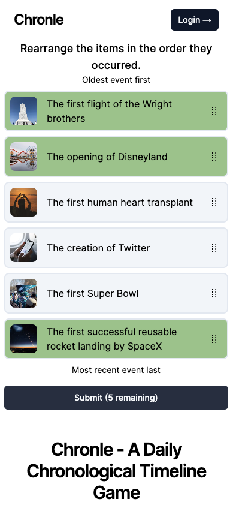

# Chronle

A daily game where you drag events into chronological order.

<https://chronle.com>



## How to Play

You are given a number of events that you must drag into chronological order. You have up to 6 tries to get all the events in the correct order.

Events that are in the correct spot will turn green. Events that are in the wrong spot will turn a solid neutral color.

## Development

1. Get accounts in order in order.

   You will need both a firebase web app and a firebase service account.

   You will need an unsplash developer account to create events from the admin dashboard.

   You will need to create a firebase project and add the firebase configuration to the `.firebaserc` file.

   ```bash
   npm i -g firebase-tools
   ```

   Then you will need to setup emulators for the project.

   ```bash
   firebase login
   firebase init
   ```

2. Get `.env` setup.

   Take all the values created from the firebase web and service account and unsplash then add them to the `.env` file.

   ```bash
   cp .env.example .env
   ```

3. Run `npm install` to install dependencies.
4. Run the development server with `npm run dev`.

This project is developed with [Next.js](https://nextjs.org/), [Firebase](https://firebase.google.com/), and [Tailwind CSS](https://tailwindcss.com/).

## License

This is licensed under AGPL-3.0. See the [LICENSE](LICENSE) file for more information.

## Credits

This starter project is based on [Venefish](https://github.com/enesien/venefish) by [enesien software](https://enesien.com/).
